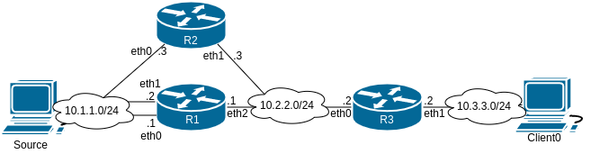
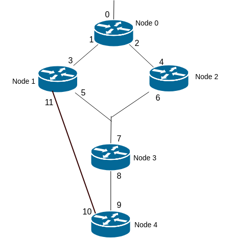

# Promela

#### Promela Topologies:
|  |  |
|:---:|:---:|
| Topology 1 | Topology 2 |

#### How to perform tests:

`spin -a FILE_NAME.pml`

`gcc -O2 -o pan pan.c -DCOLLAPSE -DVECTORSZ=1500`

`./pan -a`

#### Tests:

 1. File new_specification_all_active.pml : initially all routers consider the tree to be in Unknown state, except the Originator router, which will trigger the creation of the tree. (topology1)
 2. File new_specification_node_1_fail.pml : same as the first test, except that concurrently, node 1 fails. Due to redundant paths, all nodes should still consider the tree to be Active. (topology1)
 3. File new_specification_node_2_fail.pml : same as above, but node 2 fails, intead of node 1. (topology1)
 4. File new_specification_node_3_fail.pml : same as the first test, but node 3 fails, concurrently to the creation of the tree. Nodes 0, 1 and 2 should still consider the tree to be Active, while node 4 should consider the tree to be Unknown (no redundant paths). (topology1)
 5. File new_specification_node_3_fail_with_redundant_path.pml : same as above, but due to redundant paths, the unicast routing protocol would detect the redundant path, causing a change of Root<->Non-Root interfaces of node 4. (topology2)

#### Promela strucutre:
Each interface is modeled by two proctypes, one for the reception of packets (proctype InterfaceReceive) and the other for the transmission of packets (proctype InterfaceSend).

The proctype InterfaceReceive receives control packets from a channel, manipulates the state of a neighbor and recalculates the tree state of a node.

The proctype InterfaceSend checks if the previous tree state is the same as the new state. If not, the interface transmits a message to its neighbors (IamUpstream or IamNoLongerUpstream).

A node can have multiple interfaces (multiple proctypes InterfaceSend and InterfaceReceive),  having each one the identifier of the node that it belongs. A reception of a control packets that manipulates the state of a neighbor, can change the state of the tree of all proctype InterfaceSend belonging to the same node.

