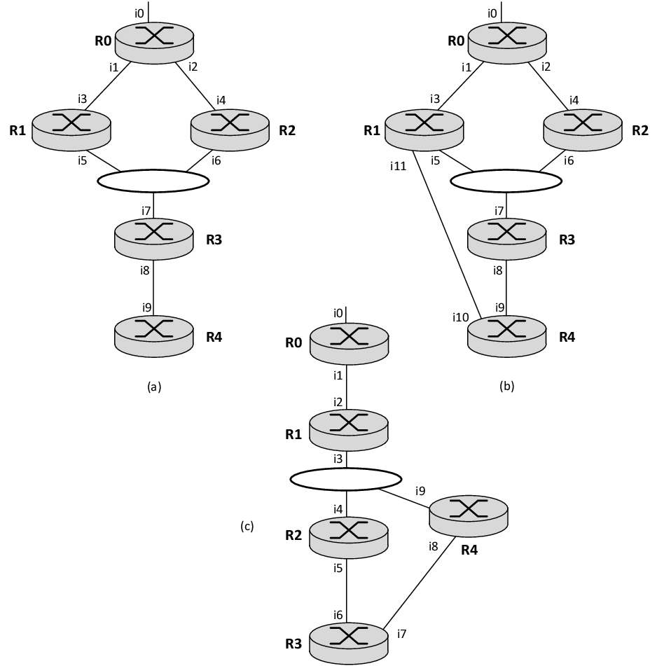

# Promela

#### How to perform tests:

```
spin -a FILE_NAME.pml
gcc -O2 -o pan pan.c -DCOLLAPSE -DVECTORSZ=15000
./pan -a
```


#### Tests:

 We have performed tests using Promela and Spin to the state machines of the synchronization process and also to the creation and maintenance of trees. A full detailed explanation of how the Promela models work can be found [here](https://github.com/pedrofran12/hpim_dm/blob/master/docs/CorrectnessTests.pdf).

##### Synchronization Tests:

 For the synchronization process we have tested the correct establishment of neighborhood relationships through our synchronization state machine.

 We have tested if two routers can correctly establish a neighborhood relationship in the presence of different number of required Sync messages to be exchanged and also in the presence of random reboots during this process. All tested variables and described in the following two tables.

|  | Tests regarding the fragmentation of Sync messages |
|:---:|:---:|
| 1 | Both routers require the same number of Sync messages to be transmitted to their neighbor |
| 2 | Both routers require different number of Sync messages to be transmitted to their neighbor|

|  | Tests regarding the presence of failures |
|:---:|:---:|
| 1 | No failures |
| 2 | Reboot of one or both routers |
| 3 | One or both routers false suspect that their neighbor has failed |

 The promela file that tests the sychronization process is  [**new_specification_sync.pml**](./new_specification_sync.pml).

##### Tree maintenance:

 We have also tested if all routers can reach a consistent state regarding a tree in the presence of reconfigurations and failures of some routers. To test this we used several topologies.


 |   | File Name | Test description to Topology (a) |
 |:---:|:---:|:---:|
 | 1 | [new_specification_all_active.pml](./new_specification_all_active.pml) | Tree formation without router failures |
 | 2 | [new_specification_node_1_fail.pml](./new_specification_node_1_fail.pml) | Tree formation concurrent to failure of Router 1 |
 | 3 | [new_specification_node_2_fail.pml](./new_specification_node_2_fail.pml) |  Tree formation concurrent to failure of Router 2 |
 | 4 | [new_specification_node_3_fail.pml](./new_specification_node_3_fail.pml) |  Tree formation concurrent to failure of Router 3 |
 | 5 | [new_specification_originator_fail.pml](./new_specification_node_originator.pml) |  Tree formation concurrent to failure of Router 0 |

 |   | File Name | Test description to Topology (b) |
 |:---:|:---:|:---:|
 | 1 | [new_specification_node_3_fail_with_redundant_path.pml](./new_specification_node_3_fail_with_redundant_path.pml) | Tree formation concurrent to failure of Router 3 and concurrent to change of interfaces' roles at Router 4 |

 |   | File Name | Test description to Topology (c) |
 |:---:|:---:|:---:|
 | 1 | [new_specification_tree_creation_with_loop.pml](./new_specification_tree_creation_with_loop.pml) | Tree formation in the presence of network loop |
 | 2 | [new_specification_tree_removal_with_loop.pml](./new_specification_tree_removal_with_loop.pml) | Tree removal in the presence of network loop |

 
